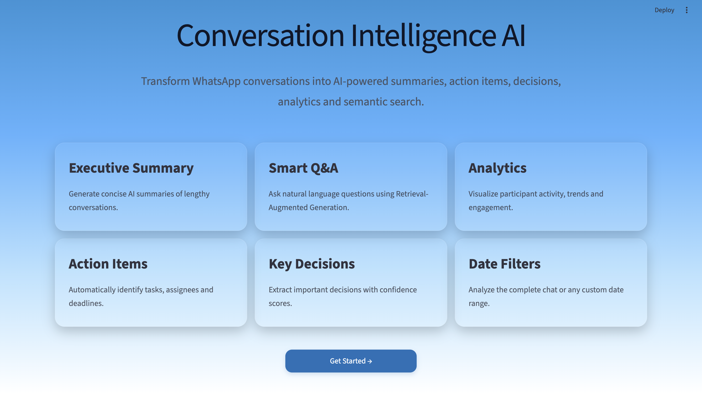
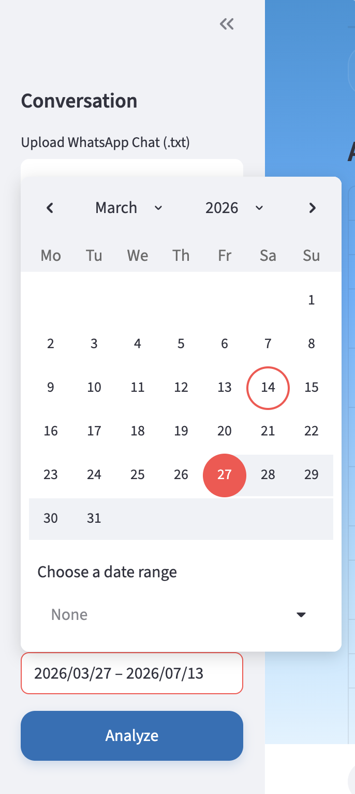
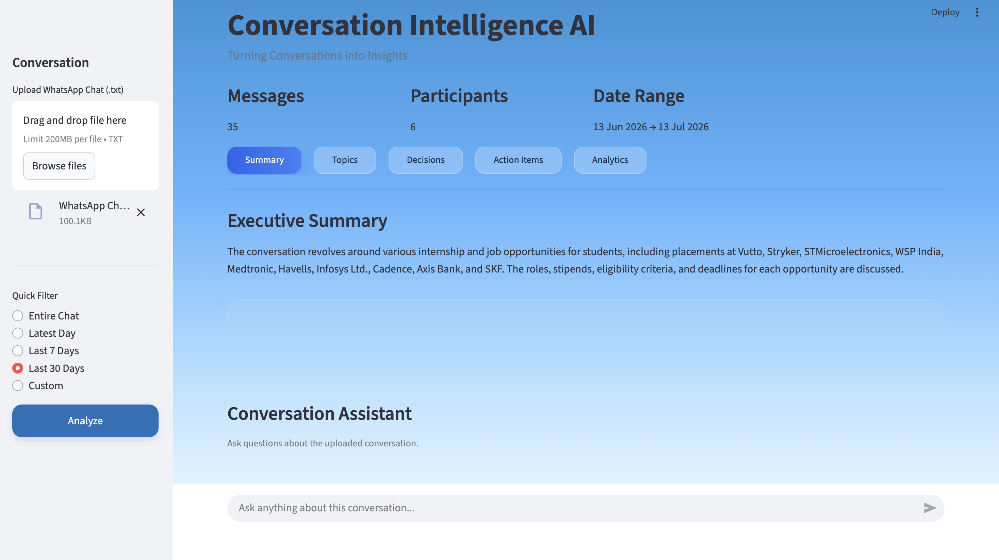
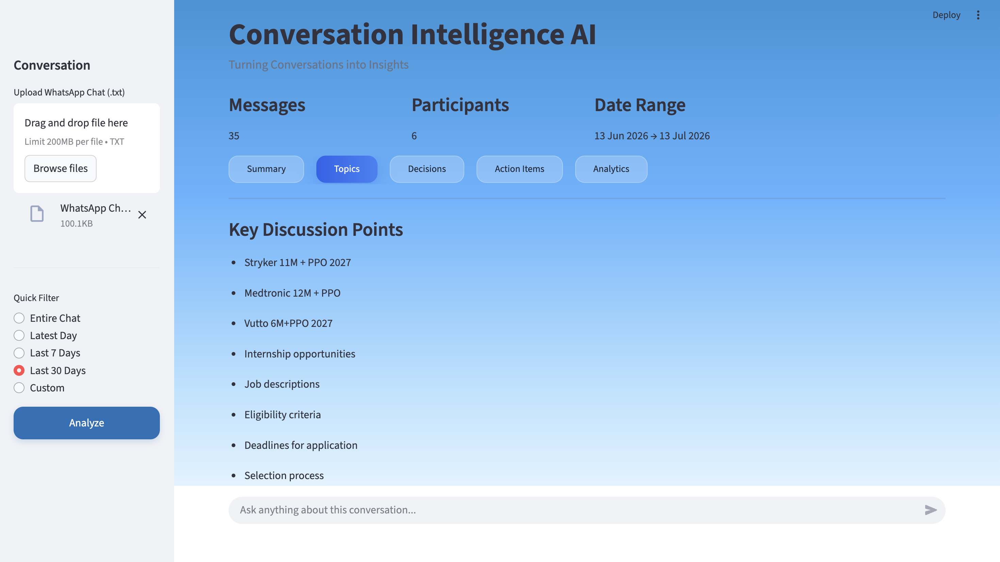
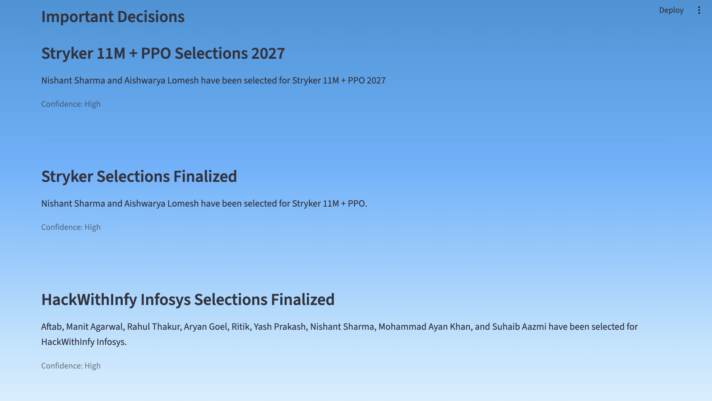
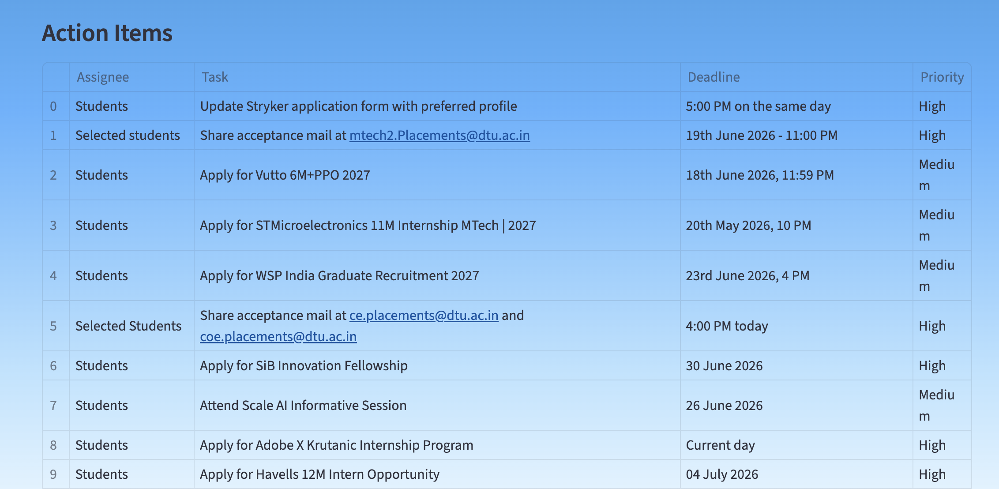
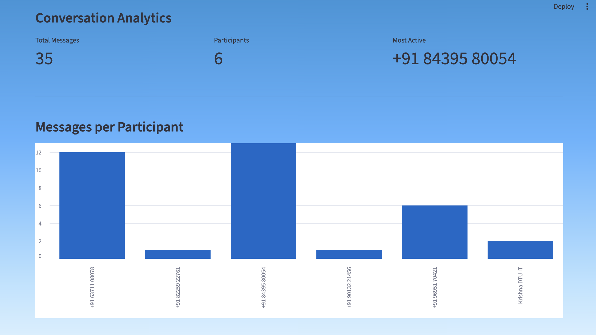
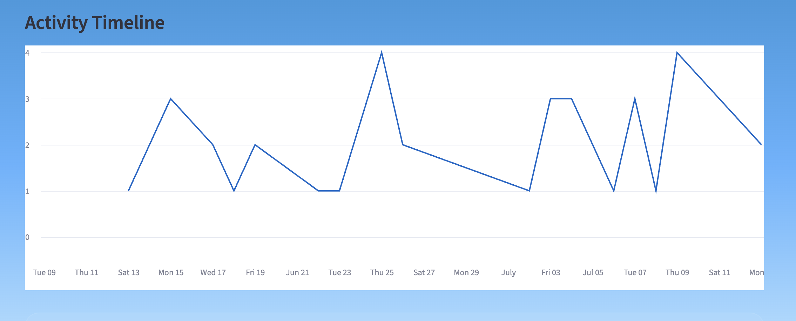
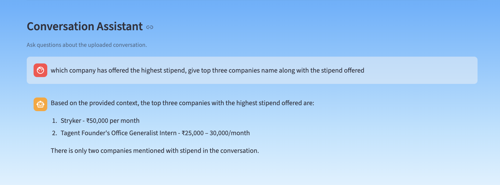
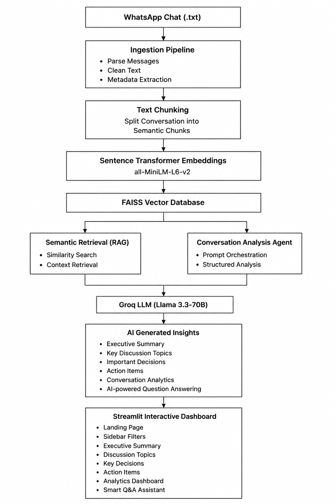

# Conversation Intelligence AI

<div align="center">

### Transform WhatsApp Conversations into Actionable Insights using Large Language Models (LLMs), Retrieval-Augmented Generation (RAG), and Semantic Search.

<p>


</p>

</div>

---

# Project Overview

Modern conversations contain valuable information such as decisions, action items, deadlines, project discussions, travel plans, meeting summaries, and important agreements. However, finding this information inside thousands of WhatsApp messages is tedious and time-consuming.

**Conversation Intelligence AI** is an AI-powered application that transforms exported WhatsApp conversations into meaningful insights through Retrieval-Augmented Generation (RAG), Semantic Search, and Large Language Models.

Instead of manually scrolling through lengthy conversations, users can simply upload a WhatsApp chat and instantly receive structured AI-generated insights, including executive summaries, key discussion topics, action items, important decisions, conversation analytics, and an intelligent question-answering assistant.

The application combines modern Generative AI techniques with Vector Databases and Semantic Retrieval to understand the context of conversations rather than relying on traditional keyword search.

---

# Problem Statement

WhatsApp has become one of the most widely used communication platforms for both personal and professional conversations.

These conversations often contain valuable information such as:

- Project discussions
- Meeting notes
- Important decisions
- Task assignments
- Deadlines
- Travel planning
- Budget discussions
- Event coordination

As conversations grow longer, retrieving this information becomes increasingly difficult.

Traditional search methods rely on exact keyword matching and fail when users cannot remember the exact words used during the conversation.

The objective of this project is to build an intelligent conversation analysis system capable of understanding the semantic meaning of messages and extracting useful information automatically.

---

# Solution

Conversation Intelligence AI provides an end-to-end pipeline for analyzing WhatsApp conversations.

The application performs the following tasks:

- Parses exported WhatsApp chat files
- Cleans and structures conversation data
- Generates semantic embeddings for every conversation chunk
- Stores embeddings inside a Faiss Vector Index
- Uses Retrieval-Augmented Generation (RAG) for contextual understanding
- Generates AI-powered summaries and insights using Groq LLM
- Presents results through an interactive Streamlit dashboard

This enables users to quickly understand long conversations without manually reading hundreds or thousands of chat messages.

---

# Key Features

| Feature | Description |
|----------|-------------|
| Executive Summary | Generate concise summaries of lengthy conversations |
| Smart Question Answering | Ask natural language questions about the conversation using Retrieval-Augmented Generation (RAG) |
| Key Discussion Topics | Automatically identify important discussion topics |
| Action Item Extraction | Detect tasks, assignees, priorities, and deadlines |
| Decision Extraction | Identify important decisions with confidence scores |
| Conversation Analytics | Visualize participant activity and conversation trends |
| Date Range Filtering | Analyze the complete conversation or specific date ranges |
| Semantic Search | Retrieve relevant messages based on meaning instead of keywords |
| Local Vector Database | Store embeddings efficiently using Faiss Vector Index |
| Modern Dashboard | Interactive Streamlit-based user interface |

---

# Demo

## Landing Page

<p align="center">

</p>

---

## sidebar

<p align="center">

</p>


---

## Executive Summary

<p align="center">

</p>

---

## Key Discussion Topics

<p align="center">

</p>

---

## Important Decisions

<p align="center">

</p>

---

## Action Items

<p align="center">

</p>

---

## Conversation Analytics

<table>
<tr>
<td align="center">

### Analytics Dashboard



</td>

<td align="center">

### Conversation Timeline



</td>
</tr>
</table>

---

## Smart Q&A Assistant

<p align="center">

</p>

---

# System Architecture

<p align="center">
  
</p>

---
# Project Workflow

The application follows an end-to-end AI pipeline that transforms an exported WhatsApp conversation into structured, actionable insights.

### Step 1 — Upload WhatsApp Chat

The user uploads an exported WhatsApp conversation (`.txt` format) through the Streamlit interface.

↓

### Step 2 — Conversation Parsing

The parser extracts:

- Sender
- Timestamp
- Message Content

The raw conversation is converted into a structured format for further processing.

↓

### Step 3 — Text Cleaning & Preprocessing

The application performs preprocessing by:

- Removing unnecessary formatting
- Handling multiline messages
- Preserving chronological order
- Cleaning metadata

↓

### Step 4 — Conversation Chunking

Large conversations are divided into smaller semantic chunks.

This enables efficient embedding generation while maintaining contextual information required for downstream AI tasks.

↓

### Step 5 — Embedding Generation

Each chunk is converted into dense vector embeddings using:

**Sentence Transformers**

```
all-MiniLM-L6-v2
```

These embeddings capture the semantic meaning of the conversation instead of relying on keyword matching.

↓

### Step 6 — Vector Storage

Generated embeddings are stored inside **Faiss**.

This allows efficient similarity search and semantic retrieval during question answering.

↓

### Step 7 — AI Analysis

The Conversation Analysis Agent processes the conversation using a Large Language Model.

The AI automatically generates:

- Executive Summary
- Discussion Topics
- Important Decisions
- Action Items

↓

### Step 8 — Semantic Question Answering

When a user asks a question,

the application:

- retrieves the most relevant conversation chunks from Faiss vector index
- provides them as context to the LLM
- generates an accurate, context-aware response

↓

### Step 9 — Analytics Dashboard

The processed information is displayed through an interactive Streamlit dashboard featuring:

- AI Summary
- Topics
- Decisions
- Action Items
- Analytics
- Smart Q&A

---

# Technology Stack

| Category | Technology |
|-----------|------------|
| **Programming Language** | Python |
| **Frontend** | Streamlit |
| **LLM Framework** | LangChain |
| **Large Language Model** | Groq (Llama) |
| **Vector Database** | FaissDB |
| **Embedding Model** | Sentence Transformers (all-MiniLM-L6-v2) |
| **Database** | SQLite |
| **Data Processing** | Pandas |
| **AI Techniques** | RAG, Semantic Search, Vector Embeddings, Prompt Engineering |

---

# Project Structure

```text
conversation-intelligence-ai/
│
├── app/
│   │
│   ├── assets/
│   │      └── favicon.png
│   │
│   ├── controller/
│   │      ├── app_controller.py
│   │      └── analysis.py
│   │
│   ├── frontend/
│   │      ├── landing.py
│   │      ├── sidebar.py
│   │      ├── tabs.py
│   │      ├── analytics.py
│   │      ├── assistant.py
│   │      ├── summary.py
│   │      ├── topics.py
│   │      ├── decisions.py
│   │      ├── actions.py
│   │      ├── metrics.py
│   │      └── styles.py
│   │
│   ├── config.py
│   └── main.py
│
├── backend/
│   │
│   ├── agents/
│   ├── analytics/
│   ├── database/
│   ├── embeddings/
│   ├── llm/
│   ├── models/
│   ├── parser/
│   ├── pipeline/
│   ├── rag/
│   ├── utils/
│   └── vectordb/
│
├── data/
│
├── requirements.txt
├── README.md
├── .env.example
└── .gitignore
```

---

# Project Modules

## Ingestion Pipeline

Responsible for processing uploaded WhatsApp chat files.

It performs:

- Conversation parsing
- Message preprocessing
- Embedding generation
- Vector database creation
- Metadata storage

---

## Conversation Analysis Agent

Analyzes the processed conversation using the Large Language Model.

Generates:

- Executive Summary
- Discussion Topics
- Important Decisions
- Action Items

---

## AI Question Answering Agent

Implements Retrieval-Augmented Generation (RAG).

The agent:

- Retrieves semantically similar conversation chunks
- Builds contextual prompts
- Generates accurate answers using the LLM

---

## Faiss vector Index

Faiss stores semantic embeddings generated from conversation chunks.

This enables efficient semantic retrieval during question answering.

---

## Analytics Module

Generates visual insights including:

- Message distribution
- Participant statistics
- Most active participant
- Conversation timeline

---

## Frontend

The Streamlit frontend provides a clean and interactive dashboard for:

- Uploading chats
- Viewing AI insights
- Exploring analytics
- Asking questions
- Filtering conversations by date

---
# Installation

Follow the steps below to set up the project on your local machine.

## 1. Clone the Repository

```bash
git clone https://github.com/Sargam208/conversation-intelligence-ai.git
```

Navigate into the project directory.

```bash
cd conversation-intelligence-ai
```

---

## 2. Create a Virtual Environment

### Windows

```bash
python -m venv venv

venv\Scripts\activate
```

### macOS / Linux

```bash
python3 -m venv venv

source venv/bin/activate
```

---

## 3. Install Dependencies

```bash
pip install -r requirements.txt
```

---

## 4. Configure Environment Variables

Create a file named `.env` in the project root.

```env
GROQ_API_KEY=your_groq_api_key
```

> **Note:** Never commit your `.env` file to GitHub.

---

## 5. Run the Application

```bash
streamlit run app/main.py
```

The application will automatically open in your default browser.

---

# 💻 Using the Application

Using the application is straightforward.

### Step 1

Upload an exported WhatsApp conversation (`.txt`).

---

### Step 2

Select one of the available date filters.

- Entire Chat
- Today
- Last 7 Days
- Last 30 Days
- Custom Date Range

---

### Step 3

Click **Analyze**.

The AI will process the conversation and generate:

- Executive Summary
- Discussion Topics
- Important Decisions
- Action Items
- Conversation Analytics

---

### Step 4

Use the **Smart Q&A Assistant** to ask natural language questions.

Example questions:

```
Who is responsible for booking the hotel?

What budget did we finalize?

What decisions were taken?

When are we leaving?

Who suggested Kasol?

Did everyone agree on the itinerary?
```

The assistant retrieves the most relevant conversation chunks before generating a response.

---

# Learning Outcomes

This project helped explore and implement several modern AI concepts including:

- Large Language Models (LLMs)

- Retrieval-Augmented Generation (RAG)

- Semantic Search

- Vector Databases

- Embedding Models

- Prompt Engineering

- Streamlit Application Development

- Modular Software Architecture

- AI Pipeline Design

---

# Contributing

Contributions, feature requests, and suggestions are welcome.

If you'd like to improve this project:

1. Fork the repository

2. Create a new branch

```bash
git checkout -b feature-name
```

3. Commit your changes

```bash
git commit -m "Added new feature"
```

4. Push your branch

```bash
git push origin feature-name
```

5. Open a Pull Request.

---

# License

This project is licensed under the **MIT License**.

Feel free to use, modify, and distribute it in accordance with the license.

---

# 👩‍💻 Author

## **Sargam Hemnani**

**M.Tech – Artificial Intelligence**

**Delhi Technological University (DTU)**

---

If you found this project useful, consider giving it a ⭐ on GitHub!
